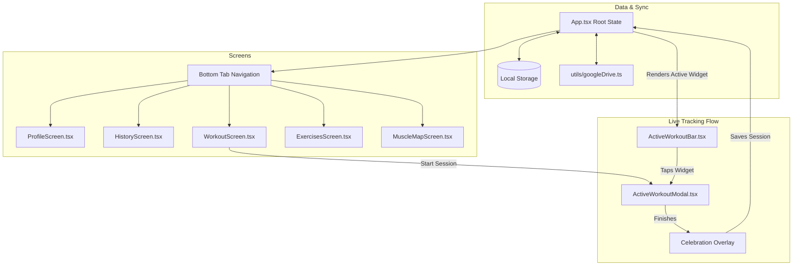

# ⚡ strongerN

A premium, high-fidelity, and battery-efficient (**AMOLED-first**) fitness tracking mobile application built with **React Native**, **Expo SDK 56**, and **TypeScript**. 

`strongerN` is designed to be the ultimate companion in the weight room, featuring a dark interface tailored to OLED/AMOLED screens, tactile micro-animations, and type-safe data modeling.

---

## 🌌 Core Features

`strongerN` goes beyond standard workout logs to offer an immersive, high-contrast tracking experience:

*   **⚡ Interactive Workout Tracker:** Start a dynamic blank session or select from preset templates (e.g., *Upper Power*, *Push*, *Pull*, *Arm Specialization*). Track duration in real-time, log sets, weights, and reps with interactive inputs.
*   **Persistent Active Widget:** A sticky bottom `ActiveWorkoutBar` follows you throughout the app during an active session. Tap it to expand the full modal sheet controller (`ActiveWorkoutModal`) without losing your place.
*   **🧠 Visual Muscle Volume Map:** Dynamic muscle group tracking. The muscles screen features an interactive SVG-powered body map that dynamically tracks weekly sets, highlights targeted muscle groups, and filters relevant exercises.
*   **📊 Analytics & Weekly Charting:** Embedded custom SVG bar charts (`BarChart.tsx`) compile workout frequency and activity trends over the last 8 weeks.
*   **📏 Body Metric & Calorie Log:** Keep track of primary metrics (body weight, body fat percentage, daily calorie targets) and individual body part sizes (chest, waist, thighs, biceps) inside a consolidated metric center.
*   **🎵 Offline Audio Chimes & `expo-audio` Integration:** Replaced the deprecated `expo-av` library with the modern `expo-audio` package. Synthesized and packaged audio files locally to support 100% offline playback with zero latency (e.g. set checked, timer alerts, completion celebration fanfare).
*   **🏆 Trophy Celebrations:** Interactive celebration overlay with haptic transitions that displays gym stats (total volume, total sets, duration) when completing a workout.
*   **☁️ Google Drive Sync & Offline Backups (Dual-Platform):** Custom integration with the Google Drive API (`utils/googleDrive.ts`) with environment-driven Client IDs (`process.env.EXPO_PUBLIC_GOOGLE_CLIENT_ID`). Supports secure popups on Web, and native system browser redirect with deep-linking callbacks (`strongern://oauth-callback` scheme) on iOS/Android. Also supports manual JSON imports/exports and CSV exports.

---

## 🎨 Design Philosophy (AMOLED-first)

`strongerN` is styled with the **UI/UX Pro Max** design system, balancing visual excellence with OLED battery efficiency.

### 1. Color System (`theme.ts`)

| Token | Value | Swatch | Purpose / Usage |
| :--- | :--- | :--- | :--- |
| **`bg`** | `#0D0F14` | ⬛ | Near-pure black base background for maximum battery efficiency. |
| **`surface`** | `#161B24` | ⬜ | Default container surface for cards and navigation bars. |
| **`surface2`** | `#1E2633` | ⬜ | Active pressed states, row selections, and hovered items. |
| **`surfaceHigh`** | `#242E3E` | ⬜ | Highly elevated surfaces (overlays, dialogs, pill inputs). |
| **`accent`** | `#4F8EF7` | 🟦 | **Electric Blue** — Primary CTAs, active status, progress bars. |
| **`highlight`** | `#38BDF8` | 🟦 | **Neon Sky Blue** — Personal records, special achievements. |
| **`gold`** | `#6366F1` | 🟪 | **Sporty Indigo** — Streak counts, trophies, active state badges. |
| **`success`** | `#22D97A` | 🟩 | Emerald green indicating completion and successful saves. |
| **`error`** | `#F0506E` | 🟥 | Neon red for destructive actions, warnings, and deletion states. |

### 2. Typography & Spatial Grid
*   **Font Family:** Geometric **Inter** loaded dynamically (weights: Regular `400`, Medium `500`, SemiBold `600`, Bold `700`).
*   **Sizes:** Mathematically scaled from `xs: 11pt` (indicators) to `hero: 38pt` (stopwatch timers, active volume trackers).
*   **Spacing:** Enforced using a strict **4pt Spatial Grid** (`xs: 4`, `sm: 8`, `md: 12`, `lg: 16`, `xl: 24`, `xxl: 32`, `xxxl: 48`).
*   **Borders:** Custom platform-specific shadow depths and high-fidelity Android tap ripples (`ripple.surface`, `ripple.accent`).

---

## 🏗️ Architecture & Project Structure

The project has a modular, component-driven architecture:

```text
strongerN/
├── assets/                  # Fonts, static assets, splash screens, and offline sounds (assets/sounds/)
├── components/
│   ├── layout/              # High-level layout widgets and tab bars
│   │   ├── ActiveWorkoutBar.tsx   # Persistent workout bottom widget
│   │   ├── ActiveWorkoutModal.tsx # Full active workout session worksheet
│   │   ├── BottomTabBar.tsx       # Custom bottom navigator bar
│   │   └── ScreenHeader.tsx       # Custom header for branding and actions
│   └── ui/                  # Reusable atomic design system tokens
│       ├── Avatar.tsx             # Circular monogram user avatar
│       ├── Badge.tsx              # Multi-colored status badge tags
│       ├── BarChart.tsx           # Custom SVG-based metrics chart
│       ├── Card.tsx               # Flex card wrappers (supports accents)
│       ├── IconButton.tsx         # Circular vector-icon button wrappers
│       ├── PressableRow.tsx       # Ripple-feedback list item containers
│       ├── SectionLabel.tsx       # Header accent line with typography
│       ├── StatCard.tsx           # Large-stat display with animated count-up
│       └── StatRow.tsx            # Column-aligned row logs for workout sets
├── data/
│   └── mockData.ts          # Strictly-typed datasets and fitness entities
├── screens/                 # High-level feature interfaces
│   ├── WorkoutScreen.tsx          # Template hub, custom builder & session starter
│   ├── ExercisesScreen.tsx        # Searchable, muscle-filtered database
│   ├── HistoryScreen.tsx          # Grid of past workouts, volume logs, and comments
│   ├── MeasureScreen.tsx          # Metric logging, logs history, and tracker
│   ├── MuscleMapScreen.tsx        # Interactive SVG visual muscle volume chart
│   └── ProfileScreen.tsx          # Statistics dashboard, settings, and Google cloud sync
├── utils/
│   └── googleDrive.ts       # Google Drive API authentication & backup handler
├── App.tsx                  # Application root, font loaders, state stores
├── theme.ts                 # Central Design System tokens and theme configuration
├── index.ts                 # Expo Entry point
├── package.json             # Scripts, configurations, and dependency lists
└── tsconfig.json            # Strict TypeScript compiler options
```

---

## 🗺️ Application Flow

Here is how the screens, modals, and data synchronize inside `strongerN`:



---

## 🚀 Getting Started

Follow these steps to run `strongerN` locally on your machine.

### Prerequisites

*   Make sure you have **Node.js** (v18+) installed.
*   Install the **Expo Go** app on your iOS/Android device to run it on mobile, or configure an Emulator/Simulator.

### Installation

1.  Clone the repository and navigate into the folder:
    ```bash
    git clone <repository-url>
    cd strongerN
    ```
2.  Install the required dependencies:
    ```bash
    npm install
    ```

### Development Scripts

Run the scripts below using `npm run <command>`:

*   **Start Expo Server:**
    ```bash
    npm start
    ```
    *(Opens the Expo developer interface. Scan the QR code with your phone camera or Expo Go app to launch).*
*   **Run on Android:**
    ```bash
    npm run android
    ```
*   **Run on iOS:**
    ```bash
    npm run ios
    ```
*   **Run on Web browser:**
    ```bash
    npm run web
    ```

---

## 🛠️ Developer & AI Guidelines

When extending or editing the codebase, please respect these core guidelines:

> [!IMPORTANT]
> **Expo SDK 56 Compatibility:** Make sure all APIs, font loaders, and platform components match Expo SDK 56 specifications (refer to [Expo Documentation](https://docs.expo.dev/versions/v56.0.0/)).

1.  **Strict Token System:** Never write hardcoded colors or sizing in your screen components. Always import and reference tokens from [theme.ts](file:///C:/Antigravity/strongerN/theme.ts).
2.  **AMOLED Compliance:** Keep the main screen backdrop pure AMOLED black (`#0D0F14`). Avoid using white containers that ruin dark adaptation or drain OLED battery life.
3.  **A11y Text Contrast:** Maintain a minimum contrast ratio of **4.5:1** for text overlays. Use `colors.textPrimary` and `colors.textSecondary` appropriately.
4.  **No Native Emojis for Icons:** For action indicators and buttons, use native vector icons from `@expo/vector-icons` (such as `Ionicons` or `Lucide`). Emojis are reserved strictly for content/badges.
5.  **Touch Target Areas:** Interactive buttons and pressables must support a minimum touch area of **44dp x 44dp** to remain accessible during intense workouts.
6.  **Haptics & Animation:** Bind key completed actions (saving, completing sets, milestones) to trigger Expo haptics, keeping the interface alive and rewarding.

---

*Developed with ❤️ and UI/UX Pro Max Design Intelligence.*
